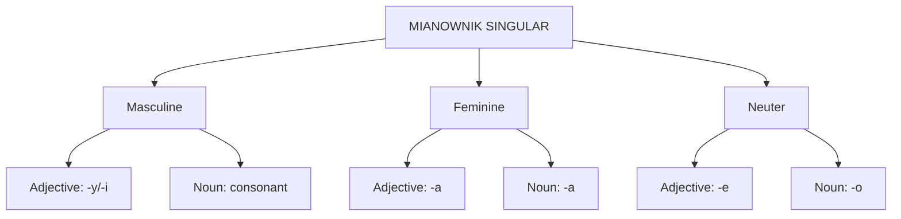
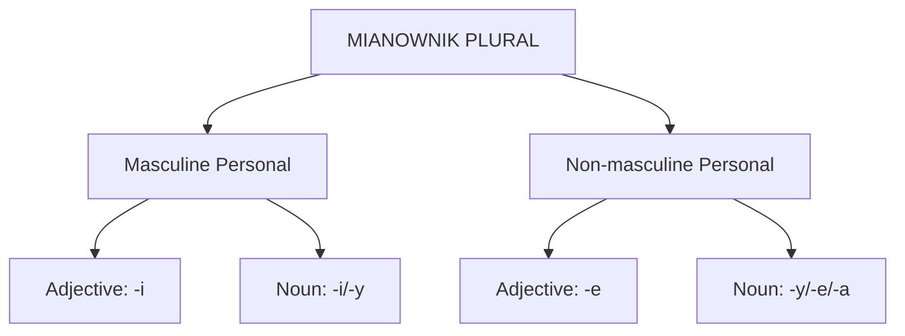

# Polish grammatical functions

## SINGULAR (MIANOWNIK LICZBA POJEDYNCZA)

```mermaid
flowchart TD
   A[MIANOWNIK SINGULAR] --> B[Masculine]
   A --> C[Feminine]
   A --> D[Neuter]
   B --> E[Adjective: -y/-i]
   B --> F[Noun: consonant]
   C --> G[Adjective: -a]
   C --> H[Noun: -a]
   D --> I[Adjective: -e]
   D --> J[Noun: -o]
```
## PLURAL (MIANOWNIK LICZBA MNOGA)

```mermaid
flowchart TD
    A[MIANOWNIK PLURAL] --> B[Masculine Personal]
    A --> C[Non-masculine Personal]
    B --> D[Adjective: -i]
    B --> E[Noun: -i/-y]
    C --> F[Adjective: -e]
    C --> G[Noun: -y/-e/-a]
```